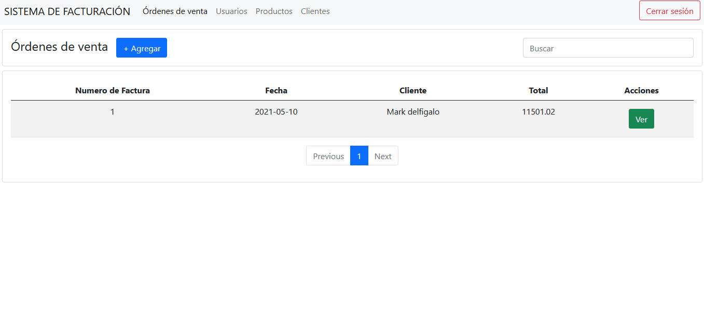
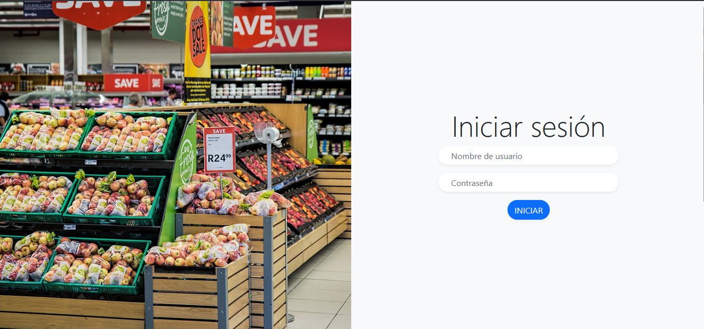
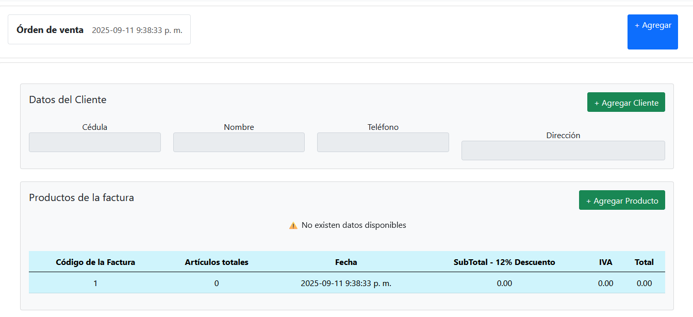
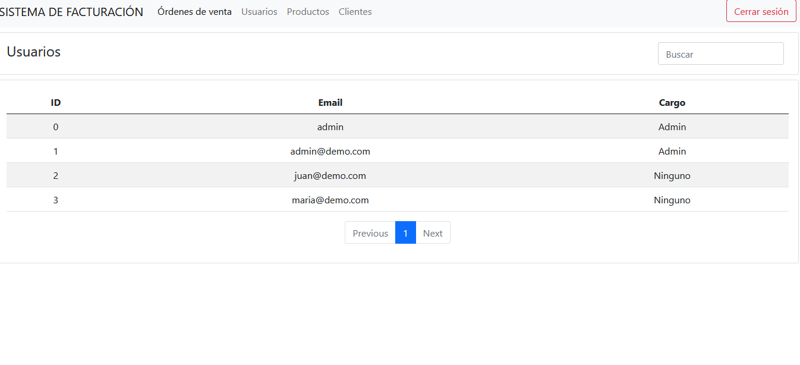

# 🧾 Sistema de Facturación

Pequeña aplicación web para la gestión de clientes, productos y facturas.  
Permite registrar facturas de manera rápida, buscar clientes y añadir productos fácilmente.

## ✨ Características principales
- 📋 Gestión de clientes y productos.  
- 🧾 Creación y administración de facturas.  
- 🔎 Búsqueda y filtrado en tablas.  
- ✅ Interfaz sencilla con modales para selección rápida.

## 🖼️ Capturas de pantalla

---

## 🚀 Tecnologías usadas
- React + TypeScript  
- Vite  
- Bootstrap  
- Axios  

---
